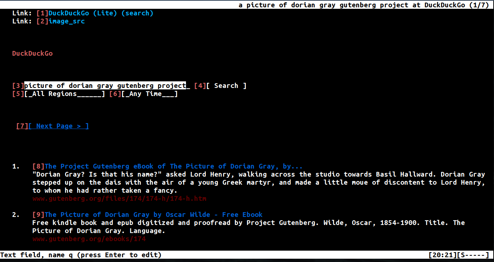
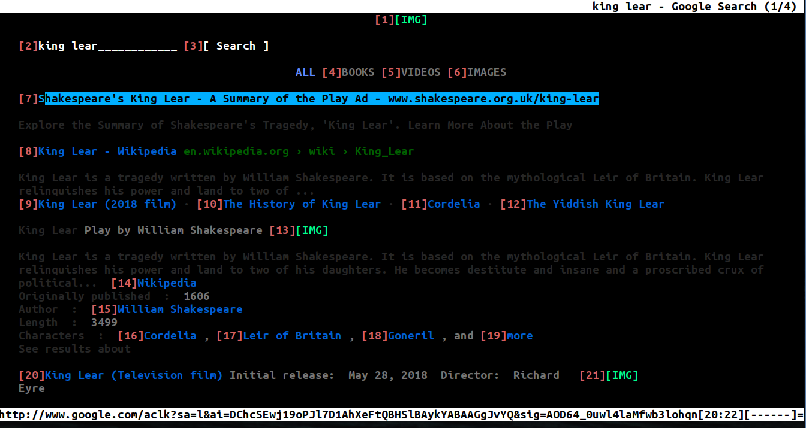

# Elinks config 
#### With Vim like keybindings 
## elinks-search script
#### A quick command line tool for quickly searching the web using Elinks

## Example of the color scheme when using DuckDuckGo

## Example of the color scheme when using Google

# elinks-search script

> **NOTE: The color scheme isn't the same in this config as it is in that gif.**  
> Look up something from the command line and open the search result in Elinks  
> E.g. `elinks-search how big is the moon`  
> For more information, type `./elinks-search --help`    
# (Optional) Dependencies
> You don't need these applications for Elinks to work. Elinks will just use whatever the default program is on your computer to view files.  
> If you plan on doing this, then get rid of anything pertaining to "MIME" in the `elinks.conf` file.  
> If you have specific programs you'd like to run, then just change the programs there.  
> For example, you can change `set mime.handler image_viewer.unix.program = "qiv -w 500 %"` to be `okular`  
> Okular would be able to display both PDFs and Images  

1. elinks  
2. PDF & EPUB Viewer  
    - `zathura  (Vim like bindings)`  
    - `zathura-pdf-mupdf`  
3. Image Viewer  
    - `qiv`  

# Regular Install (Config + elinks-search script + automatic setup)
> Note: You can change the shell (.bashrc -> .zshrc) and alias (www -> something-shorter)  
`git clone https://github.com/Tylryan/elinks-config.git ~/.elinks && cp ~/.elinks/elinks-search /usr/bin/ && echo "www='/usr/bin/elinks-search'" >> ~/.bashrc`

## Install the config WITHOUT the elinks-search script
`git clone https://github.com/Tylryan/elinks-config.git ~/.elinks && elinks`  

## Manually install of everything

- `git clone https://github.com/Tylryan/elinks-config.git .elinks`
- Put `.elinks` in your home directory
- Put the `elinks-search` bash script wherever your other Binaries are located.  
    - `echo $PATH | tr ':' '\n'`  
- Alias `elinks-search` to something shorter, like `www`
    - `echo "alias www=`path/to/elinks-search >> ~/.bashrc`"`
